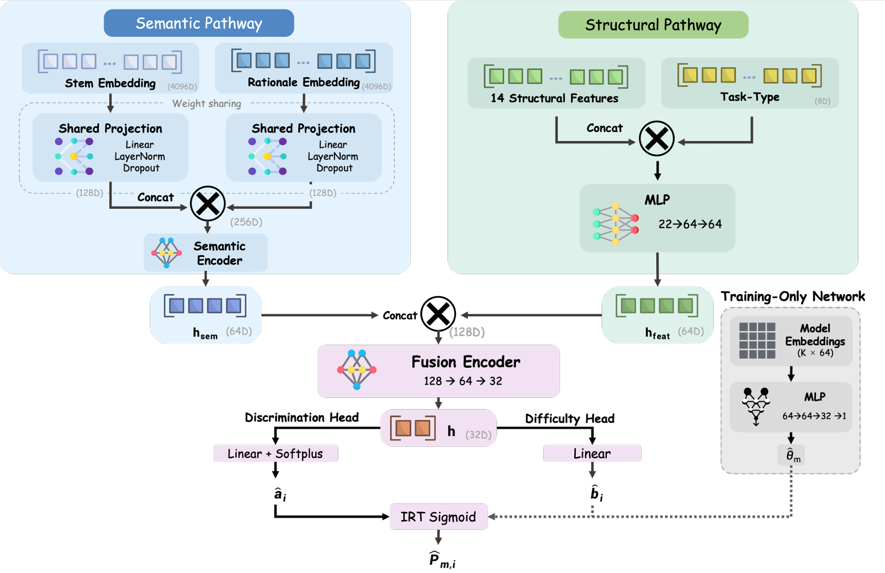

# FAIR-Eval: Feature-Augmented IRT for Reliable and Efficient LLM Benchmarking

FAIR-Eval is a feature-augmented semantic IRT pipeline for reliable and efficient LLM benchmarking.



[PDF version](assets/figures/fdc_model.pdf)

## Overview

The released pipeline supports four stages:

1. builds a unified HDF5 benchmark file,
2. trains a semantic calibration model with item-level cross-validation,
3. exports item discrimination and difficulty parameters, and
4. exports ranked model ability (`theta`) estimates.

## Code Release

The main release includes:

- `build_hdf5_from_prepared.py` for packaging prepared response and item tables into a single HDF5 benchmark file
- `calibration_model_train.py` for semantic 2PL calibration with item-level cross-validation
- `item_params_inference.py` for exporting item discrimination and difficulty parameters
- `theta_inference.py` for exporting model-level ability estimates
- `hle_rebuild/` for reconstructing HLE-derived items and responses from user-provided upstream data

## Public Data Release

The public FAIR-Eval data release includes:

- `irt_data_items.parquet`
- `irt_data_responses.parquet`
- `irt_data.hdf5`

This public release is derived from `stair-lab/reeval` and `SuperGPQA` and excludes HLE-derived content. The `hle_rebuild/` directory provides reconstruction scripts for users who independently obtain the upstream HLE source data and comply with its access and redistribution conditions.

## Input Format

`build_hdf5_from_prepared.py` expects:

- a response parquet file with at least `scenario`, `question`, `model`, `score`
- an item parquet file with at least `scenario`, `question`

Optional item columns include:

- `question_embedding`
- `rationale` or `solution`
- `rationale_embedding`
- item-level feature columns such as question-length, answer-length, interaction, and task-type features

## Quick Start

Use Python 3.10 or newer.

```bash
pip install -r requirements.txt
```

If you need a CUDA-enabled PyTorch build, install the matching wheel from the official PyTorch index for your platform.

### 1. Build the benchmark file

```bash
python build_hdf5_from_prepared.py \
  --responses path/to/irt_data_responses.parquet \
  --items path/to/irt_data_items.parquet \
  --output path/to/irt_data.hdf5
```

### 2. Train the calibration model

```bash
python calibration_model_train.py \
  --h5 path/to/irt_data.hdf5 \
  --output-dir path/to/model_train_outputs \
  --epochs 200 \
  --batch-size 256 \
  --lr 1e-3 \
  --n-splits 10
```

### 3. Export item parameters

```bash
python item_params_inference.py \
  --h5 path/to/irt_data.hdf5 \
  --cv-results path/to/model_train_outputs/cv_results.json \
  --output-csv path/to/items_params.csv \
  --fold-select best_auc
```

### 4. Export model ability estimates

```bash
python theta_inference.py \
  --h5 path/to/irt_data.hdf5 \
  --cv-results path/to/model_train_outputs/cv_results.json \
  --output-csv path/to/theta_estimates.csv \
  --fold-select best_auc
```

## Main Outputs

- `irt_data.hdf5`: unified benchmark file used by the full pipeline
- `cv_results.json`: best validation metrics and checkpoint path for each fold
- `feat_norm.pt`: feature normalization statistics reused at inference time
- `fold_*.pt`: trained calibration checkpoints
- `items_params.csv`: inferred item discrimination and difficulty parameters
- `theta_estimates.csv`: ranked model ability estimates

## HLE Reconstruction

The public release excludes HLE-derived rows. Users who need the HLE-derived portion should use the scripts under `hle_rebuild/` together with:

- an authorized local copy of the upstream HLE data
- the released subset ID list
- the released HLE response table keyed by `question_id`

The `hle_rebuild/` workflow additionally uses `openai` and optionally `spacy`.

## Citation

If you use this code, please cite:

```bibtex
@misc{fair_eval,
  title={FAIR-Eval: Feature-Augmented IRT for Reliable and Efficient LLM Benchmarking},
  author={To be updated},
  year={2026}
}
```
